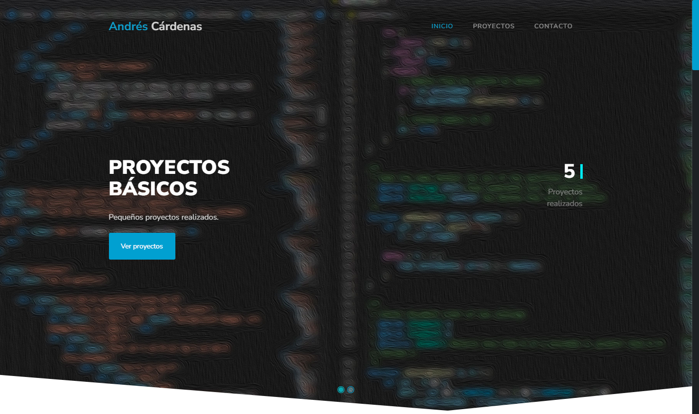

# Portafolio 2022

Se desarrolla una primera versión en su tiempo del portafolio para fortalecer las habilidades en HTML, CSS y JS.
Todo el contenido está hecho con flaticon y uno que otro con fontawesome y unas alertas con popup. También se impelemntó bootstrap y ajax.

<a href="https://andrescardenas29.github.io/portafolio2022/" target="_blank">
  https://andrescardenas29.github.io/portafolio2022/"
</a>

